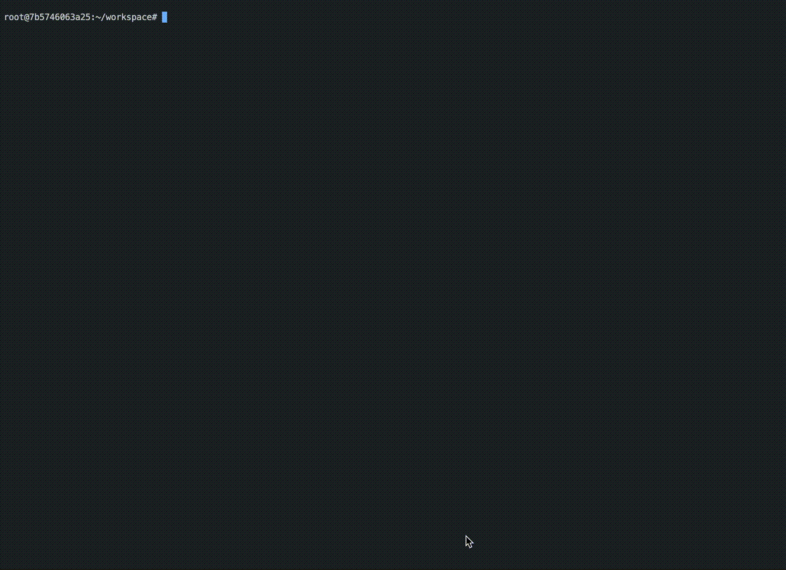

<!-- @format -->

# Open-Interpreter-Sample

## Open-Interpreter : https://openinterpreter.com/

- Open Interpreter は、ChatGPT が提供する「[Advanced Data Analysis](https://www.pluralsight.com/resources/blog/data/ChatGPT-Advanced-Data-Analytics)(旧 Code Interpreter)」の OSS 版とも言える存在で、Python、Javascript、Shell などのプログラミング言語のコード生成、実行環境構築、実行が対話形式で実現

- Advanced Data Analysis との大きな違いは、ローカル環境で動作するため、ファイルアクセスやインターネット接続の制限がないため、より幅広い分野で利用可能

  

## Note

- Open-Intepreter の利用にあたっては以下の懸念点があるため、**本リポジトリの Dockerfile からビルドした Docker コンテナなどファイルアクセスやシステム設定などが制限された環境で試すことがオススメ**
  - セキュリティ : ローカル内のファイルやシステム設定に Open-Interpreter はアクセスできてしまうため、セキュリティ面の懸念に加え、各種ファイルや設定項目の変更、削除されてしまう
  - 開発環境 : 必要なパッケージを勝手にインストールされ、開発環境が荒らされる

## Usage

### Requirement

- Docker

### Build docker image

```shell
$ make build
```

### Set .env file

- API キーなどを設定

#### Use Open AI API

```shell
OPENAI_API_KEY=***
```

#### Use Azure OpenAI Service

```shell
AZURE_API_KEY=***
AZURE_API_BASE=***
AZURE_API_VERSION=***
AZURE_DEPLOYMENT_NAME=***
```

### Run docker container

```shell
$ make run
```

### Run Open-Interpreter

#### Use OpenAI API

```shell
# use GPT-4(default)
root@hostname:~/workspace interpreter

# use GPT3.5-turbo
root@hostname:~/workspace interpreter --fast
```

#### Use Azure OpenAI Service

```shell
# use GPT-4(default)
root@hostname:~/workspace interpreter --use-azure

# use GPT3.5-turbo
root@hostname:~/workspace interpreter --use-azure --fast
```
